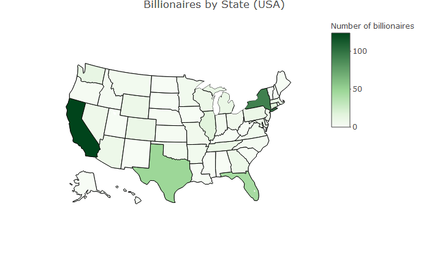

# BillionairesUS
R scripts to scrape and plot data on billionaires in the United States

I noticed the following chart on Wikipedia's [list of U.S. states by number of billionaires](https://en.wikipedia.org/wiki/List_of_U.S._states_by_the_number_of_billionaires).

A few outliers really skew the bin sizes, so I started out trying to reproduce the map by scraping the data and plotting it in R. That's done in [billionaires.R](billionaires.R).

This looks a lot like a [heatmap of the United States](https://en.wikipedia.org/wiki/List_of_U.S._states_and_territories_by_population), with the most populous states like CA, NY, and FL, having the most billionaires. Not very suprising. So I scraped population data as well, and combined it to create a column for billionaires per capita. That's done in [billionaires_per_capita.R](billionaires_per_capita.R). This reveals that states like Wyoming and Connecticut have an inordinate number of billionaires for their population size.

